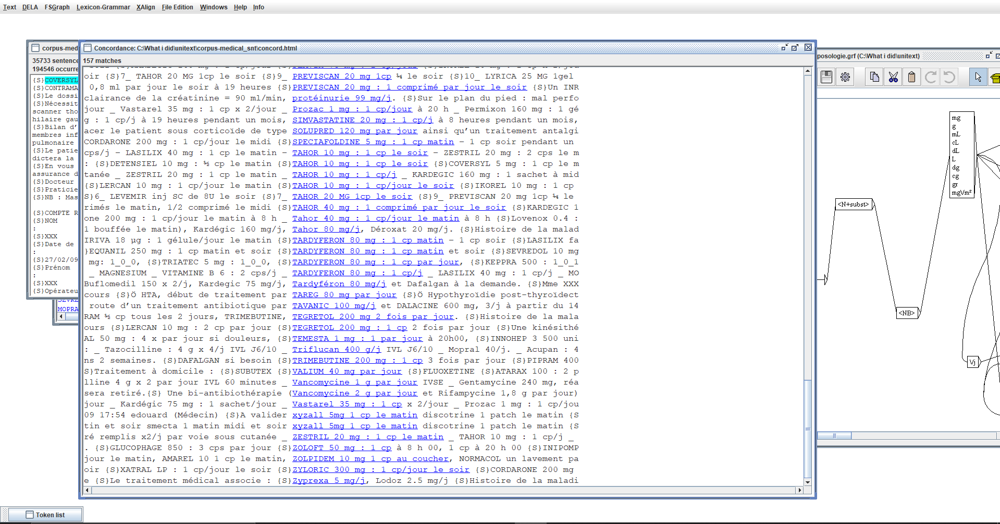

# vidal-drugs-extractor
# Extract drugs informations from a medical courpus


This contains the name of the medicine, dosage (size and frequency of a dose of the medicine), and how each dose should be administered.

##### For example :
SIMVASTATINE 20 mg: 1 tab / day at 8 hours for one month

CYTARABINE 100 mg / m² from D1 to D7

ZOLPIDEM 10 mg 1 tab at bedtime

METFORMIN 850 mg 3 times a day

SPECIAFOLDINE 5 mg: 1 tab morning

ALADACTONE 25 mg: 1 tab / day at noon

INEXIUM 40 1 tab per day in the evening

# Installation
Colne this project :
```bash
git clone https://github.com/walgt/nlp-project.git
```
Install [unitex](https://unitexgramlab.org/)

Install [python](https://www.python.org/)

Install [apache web server](https://httpd.apache.org/) ( you can install WampServer, XAMPP or EasyPHP-DevServer, etc. )


# usage
##### aspirer.py
The first python script "aspirer.py" will collect the names of drugs from 26 HTML pages (A-Z) of "Vidal" directory.
you can determine the interval of the pages to be processed, respecting the format: B-H, E-S or A-W, etc. This interval is the first argument of our first Python script.
you can also enter the port which is specified in the Apache web server configuration file. This port is the second argument of our first Python script.
Note: The default http port is port 80.

this will output : 
a dictionary in .dic format (DELAF-UNITEX FORMAT) named "subst.dic".
a file named "infos.txt" containing:
o the number of drugs found in the dictionary Previously generated "subst.dic" for each letter of the alphabet;
o the total number of drugs found in the dictionary.

##### enrichir.py
The second python script "enrichir.py" will enrich the dictionary "subst.dic" with new drugs names from "corpus-medical.txt" given as an argument.
this will  also  Output a dictionary in .dic format (DELAF-UNITEX FORMAT) named "subst_enri.dic" containing the new drugs names as well as "infos2.txt".

##### posologie.grf
"posologie.grf" is an extraction graph built under UNITEX which is based on the label <N + subst> from the "subst.dic" dictionary, in order to extract the occurrences of
“Treatment dosages” from the "corpus-medical.txt" file.

Using the dictionary "subst.dic", the graph "posologie.grf", the corpus "corpus-medical.txt" and UNITEXT, we will get the ilst of posoligies, as shown in this screenshot :



we can get this result using either the GUI of UNITEXT or by executing the python script "unitex.py" ( for linux users only ).
 
